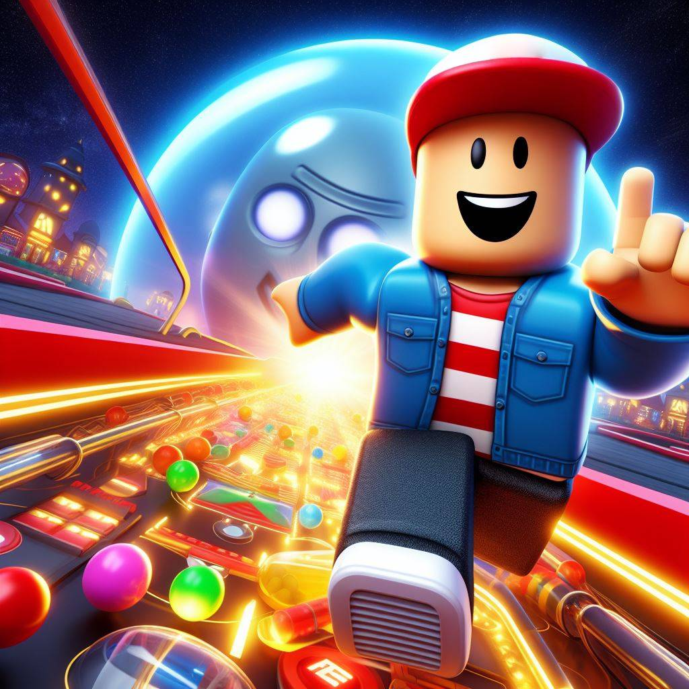

# SurviveArcade [](https://github.com/GreenAppers/SurviveArcade/actions/workflows/build.yml)

[](https://ro.blox.com/Ebh5?af_dp=roblox%3A%2F%2FplaceId%3D15699266223%26launchData%3Dutm1%25253A0%25252C0%25252Cweb-link%25252Chome-hero-play-button%25252C%25253B&af_web_dp=https%3A%2F%2Fwww.roblox.com%2Fgames%2Fstart%3FplaceId%3D15699266223%26launchData%3Dutm1%25253A0%25252C0%25252Cweb-link%25252Chome-hero-play-button%25252C%25253B)

[Join the Experience](https://ro.blox.com/Ebh5?af_dp=roblox%3A%2F%2FplaceId%3D15699266223%26launchData%3Dutm1%25253A0%25252C0%25252Cweb-link%25252Chome-hero-play-button%25252C%25253B&af_web_dp=https%3A%2F%2Fwww.roblox.com%2Fgames%2Fstart%3FplaceId%3D15699266223%26launchData%3Dutm1%25253A0%25252C0%25252Cweb-link%25252Chome-hero-play-button%25252C%25253B) (BETA)!

## Setup

Install [Roblox Studio](https://www.roblox.com/create), [Visual Studio Code](https://code.visualstudio.com/download), Git and git clone this repo.

### Install VSCode Extensions

- [Rojo](https://marketplace.visualstudio.com/items?itemName=evaera.vscode-rojo)
- [Rojo UI](https://marketplace.visualstudio.com/items?itemName=muoshuu.rojo-ui)
- [Rojo Explorer](https://marketplace.visualstudio.com/items?itemName=Meqolo.rojo-explorer)
- [Selene](https://marketplace.visualstudio.com/items?itemName=Kampfkarren.selene-vscode)
- [StyLua](https://marketplace.visualstudio.com/items?itemName=JohnnyMorganz.stylua)
- [Roblox LSP](https://marketplace.visualstudio.com/items?itemName=Nightrains.robloxlsp)
- [Roblox TS](https://marketplace.visualstudio.com/items?itemName=Roblox-TS.vscode-roblox-ts)

### Install Rojo

- VSCode > Command+Shift+P `Rojo: Open Menu`

Use the menu to install Rojo and Roblox Studio Plugin. Then `Click to start live syncing`.

### Install Lune
 
```console
aftman install
lune --version
```

### Install Node.js 18.18.0 with Node Version Manager:

```console
curl -o- https://raw.githubusercontent.com/nvm-sh/nvm/v0.39.1/install.sh | bash
echo ". ~/.nvm/nvm.sh" >> ~/.zprofile
nvm install 18.18.0
nvm use 18.18.0
node --version
npm install --global yarn
```

## Build `SurviveArcade.rbxl`

```console
yarn && yarn build
```

## Studio

- Install [Hoarcekat](https://create.roblox.com/marketplace/asset/4621580428/Hoarcekat) plugin
- Install [BTreesV5](https://create.roblox.com/store/asset/4702098000/BTreesV5) plugin
- Install [rbxts-object-to-tree](https://www.roblox.com/library/3379119778/rbxts-object-to-tree) plugin
- Open `SurviveArcade.rbxl` in Roblox Studio.
- Click Play to test.

## Workflow

- VSCode > NPM Scripts > Watch
- VSCode > NPM Scripts > Sync
- Studio > Plugins > Rojo > Connect to `rojo serve` running in VS Code.
- Develop scripts in VSCode
- Develop Models in Roblox Studio
- Drag `Level1` from `Replicated Storage > Arcade Tables` to `Workspace` when modeling. Drag back to play.

## Prepare Pull Request

### Automatic

- Save changes to `SurviveArcade.rbxl`

```console
yarn syncback
```

### Manual

- Save updated models to file-system as `.rbxmx` (Roblox Model XML)

## Pull Request

```console
git checkout -b my-new-updates
git commit -am "Updated game"
git push origin my-new-updates
```

## Deploy

```console
mantle deploy --environment beta
```

## Credits

- [roblox-ts](https://github.com/roblox-ts/roblox-ts)
- [Rojo](https://github.com/rojo-rbx/rojo) by [LPGhatguy](https://github.com/LPGhatguy)
- [Reflex](https://github.com/littensy/reflex) by [littensy](https://github.com/littensy)
- [Slither](https://github.com/littensy/slither) by [littensy](https://github.com/)
- [Roblox-TS-Template](https://github.com/MonzterDev/Roblox-TS-Template) by [MonzterDev](https://github.com/MonzterDev)
- [roblox-ts-project-template](https://github.com/christopher-buss/roblox-ts-project-template) by [christopher-buss](https://github.com/christopher-buss)
- [FastCast](https://etithespir.it/FastCastAPIDocs/) by [EtiTheSpirit](https://github.com/EtiTheSpirit)
- [Gravity Controller](https://devforum.roblox.com/t/wall-stickgravity-controller/432598/404) by [Ego Moose](https://github.com/EgoMoose)
- [Skybox AI](https://skybox.blockadelabs.com/) by [Blockade Labs](https://www.blockadelabs.com/)
- [SnowB Bitmap Font](https://snowb.org/): Bitmap Font Generator Onlina
- [Android Asset Studio](https://romannurik.github.io/AndroidAssetStudio/icons-launcher.htmle)
- Image and narrative generation by [Together AI](https://www.together.ai/) and [Microsoft Designer](https://designer.microsoft.com/)
- Roblox community for models, plugins, tutorials, and help!
